# APOLLO Project

**APOLLO (Advanced Platform for Open Labs, Logistics, and Operations)** is an open-source, FAIR-compliant laboratory inventory and compliance management system developed by biobank.cy. Designed for biomedical research environments, APOLLO helps labs track reagents, manage safety documentation (e.g., SDS), monitor stock levels, and align with ISO/GLP standards. It promotes reproducibility, audit readiness, and operational transparency—making advanced lab management accessible to all.

**APOLLO** is a modern web application consisting of a **C# RESTful API** backend and a **React (TypeScript)** frontend. This project is designed for organizations that need efficient tracking and flow management of their inventory.

## Project Structure

- `/api`: The **C# RESTful API** backend built using .NET.
- `/client`: The **React (TypeScript)** frontend for the user interface.

## Prerequisites

Make sure you have the following installed on your machine:

- **.NET SDK** (for the API)
- **Node.js** and **npm** (for the client)
- **MariaDB Server (minimum v10.11.2)**

## Installation

### Backend (API)
1. Navigate to the `/api` folder.
2. Run `dotnet restore` to install the dependencies.
3. Update your appsettings.json with the required configuration.

### Frontend (Client)
1. Navigate to the `/client` folder.
2. Run `npm install` to install the dependencies.
3. Create a `.env` file based on `.env.example`.

## Running the Project
To Be Added (TBA)

## UI Overview
Below are examples of the primary screens and dialogs in the **APOLLO** Web Application.

---

### Catalog

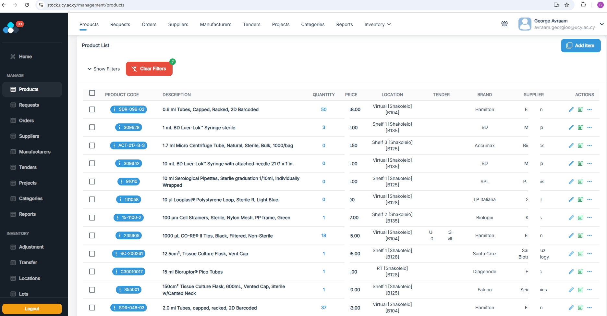  
*List of all catalog items with quick-action buttons for requests and orders.*

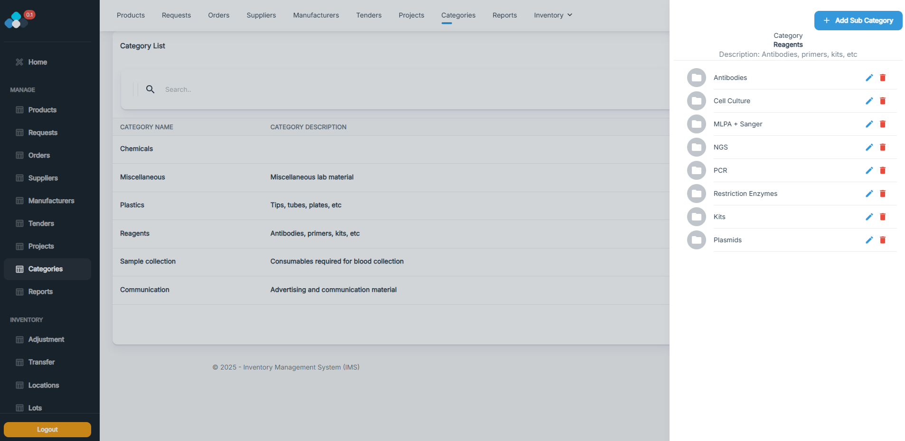  
*Hierarchical navigation of product categories and nested subcategories.*

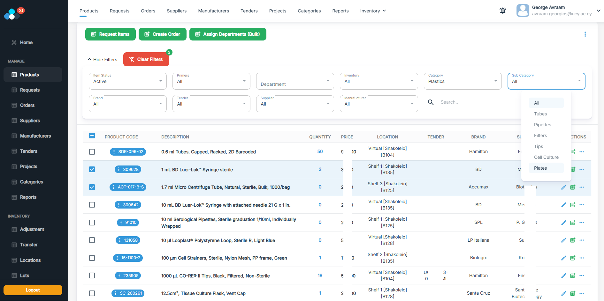  
*Advanced filter panel and search bar to narrow down products by status, brand, supplier, etc.*

---

### Inventory Management

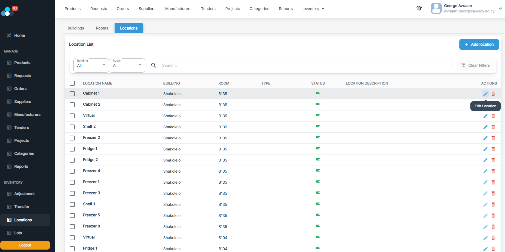  
*Map/list view showing every storage location and its current status.*

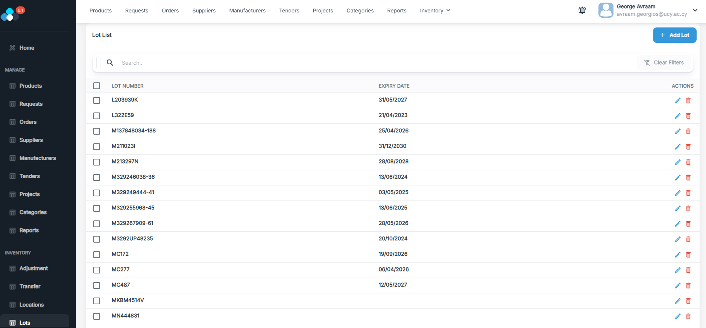  
*Table of inventory lots with lot numbers and expiry dates*

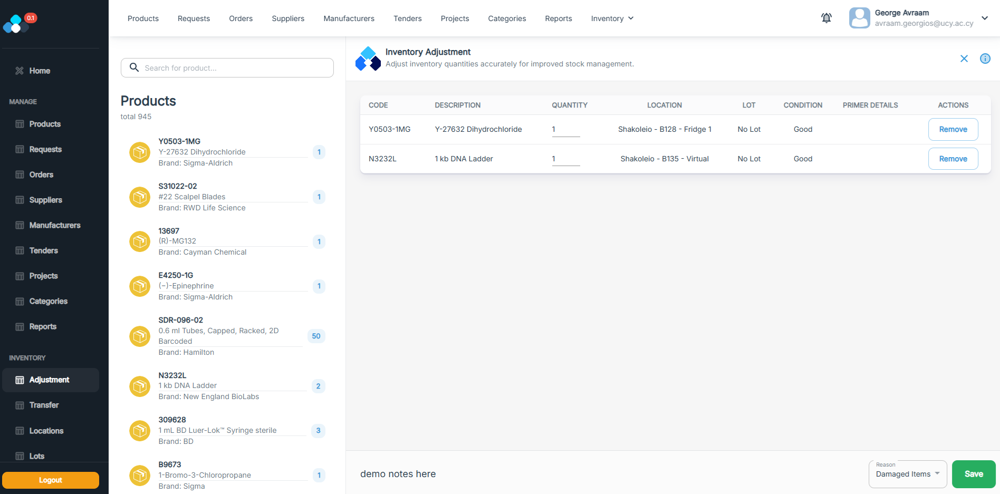  
*Form for adjusting inventory levels—search and choose the item and location,choose available lot, enter the delta, select a reason, and add optional comments.*

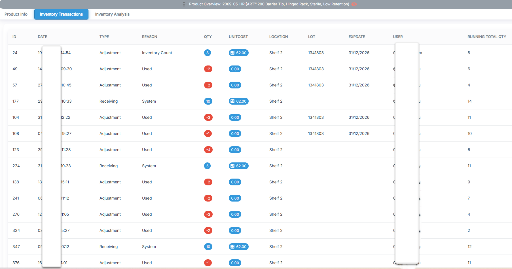  
*Chronological log for the selected product, detailing each stock movement, manual adjustment, and transfer, complete with timestamps, quantity changes, and user notes.*

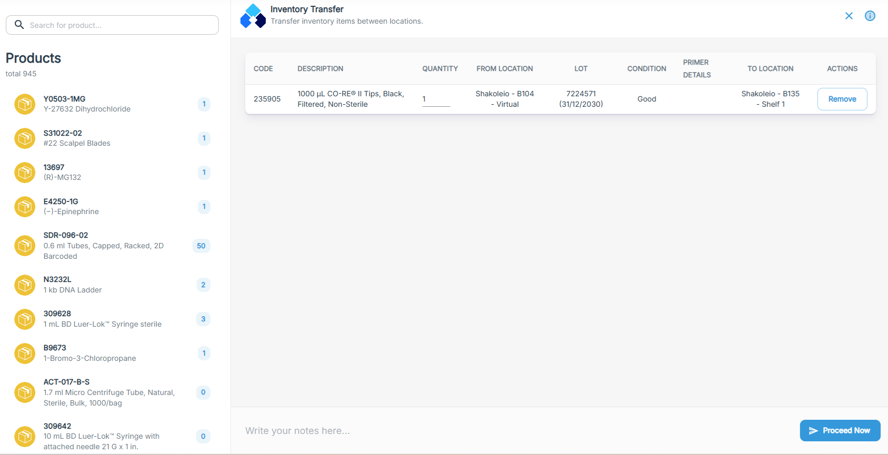  
*Interactive form for creating stock transfers between locations—select source and destination, specify quantities, and add optional notes.*

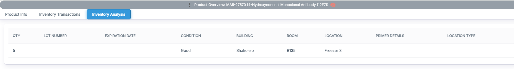  
*Table view listing current inventory for the selected product, grouped by lot number and storage location, including available quantities and expiration dates.*

---

### Ordering & Receiving

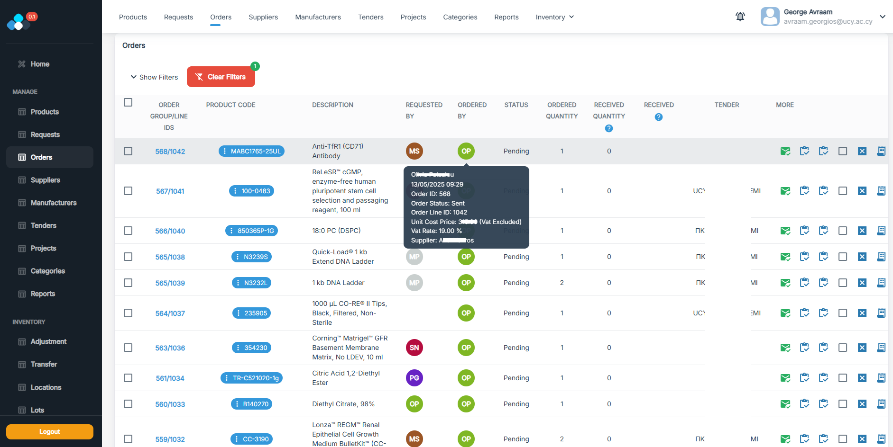  
*Detailed purchase orders list for the selected product, showing supplier, order date, requesting user, and receipt status (fully, partially, or not yet received), with quick-action buttons for receiving items and accessing related supplier invoices.*

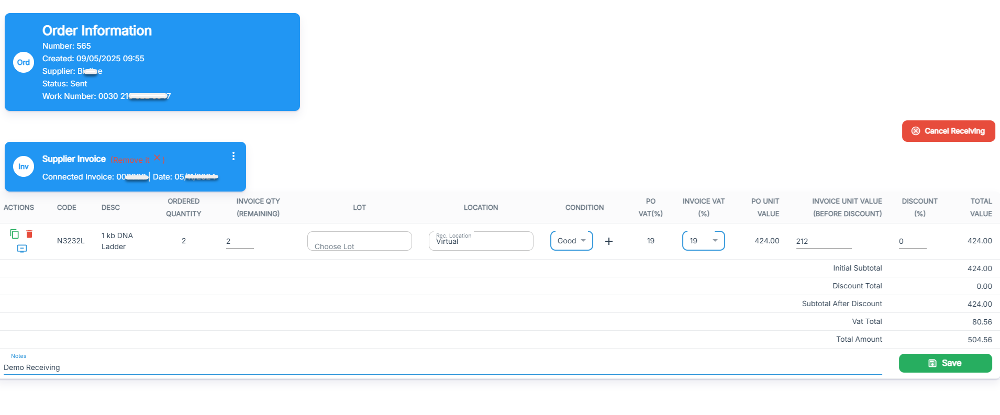  
*Form for logging received shipments: enter received quantities, link to a supplier invoice (number, date, and amounts), upload the PDF invoice for paperless records, and have stock levels update automatically.*

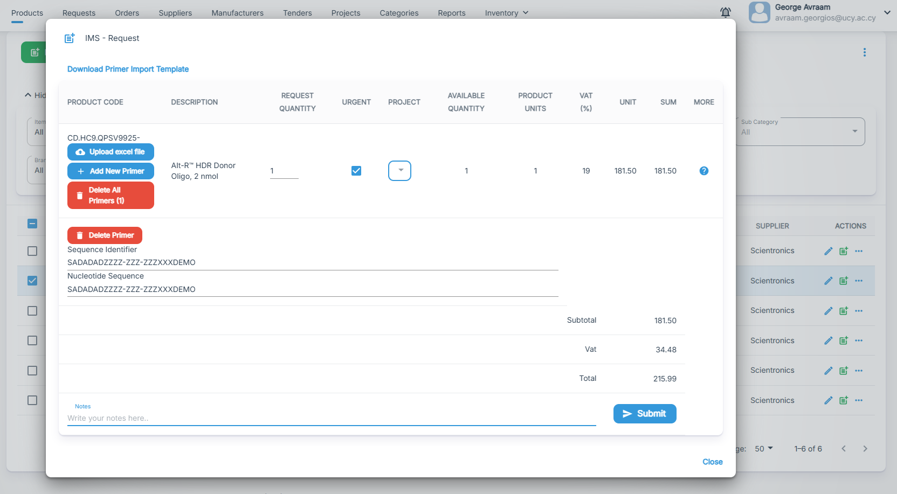  
*Request form for custom primer orders—manually enter individual sequences or batch-import from an Excel file, specify quantities, assign to a project, and add optional comments.*

---

### Requests

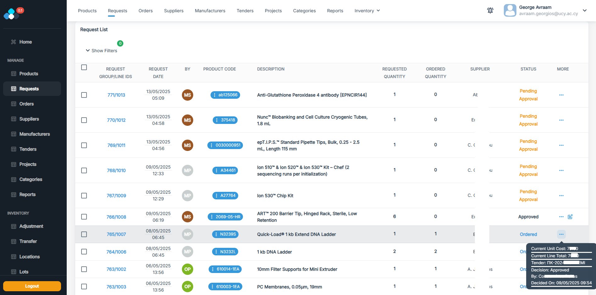  
*Comprehensive table of reagent and material requests—includes column filters, inline status updates, approval status, estimated cost, submitting user, approver, request date, and quick-action buttons.*

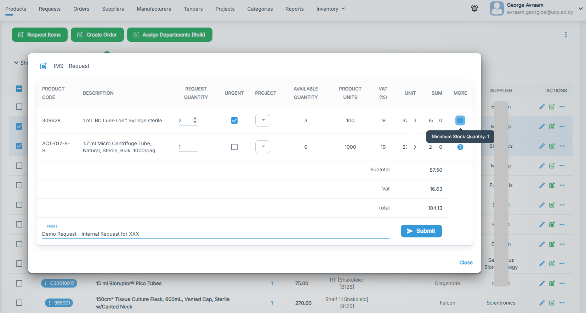  
*Popup form to submit new product requests, set urgency, and optionally assign to a project.*

---

### Procurement & Planning

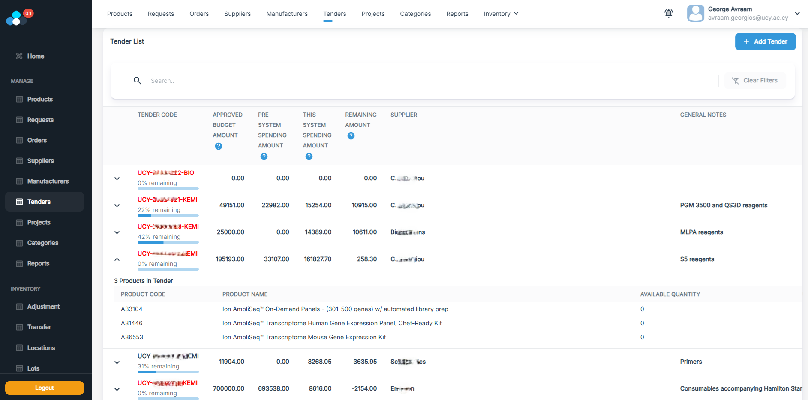  
*Overview of tenders with budget usage bars and expandable product line-items.*

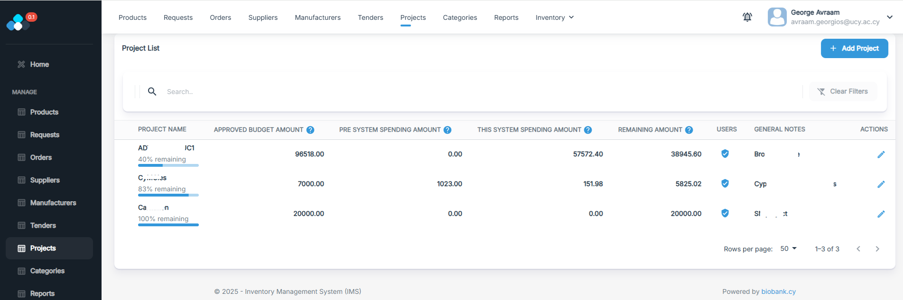  
*Overview of projects, showing approved budget, spend to date, and remaining funds.*

---

### Administration

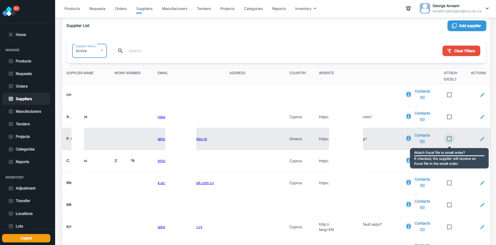  
*List of suppliers with contact details and country, featuring a toggle to include an Excel attachment directly in the email when placing a purchase order.*

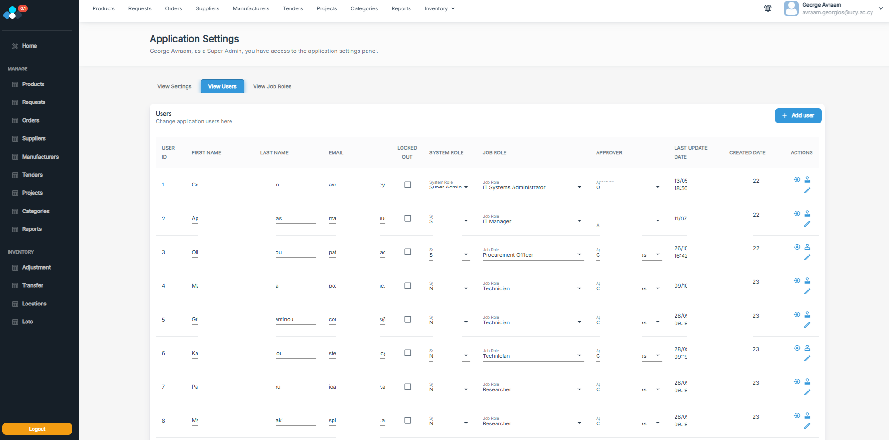  
*Admin view of all user accounts, roles, and approver assignments.*

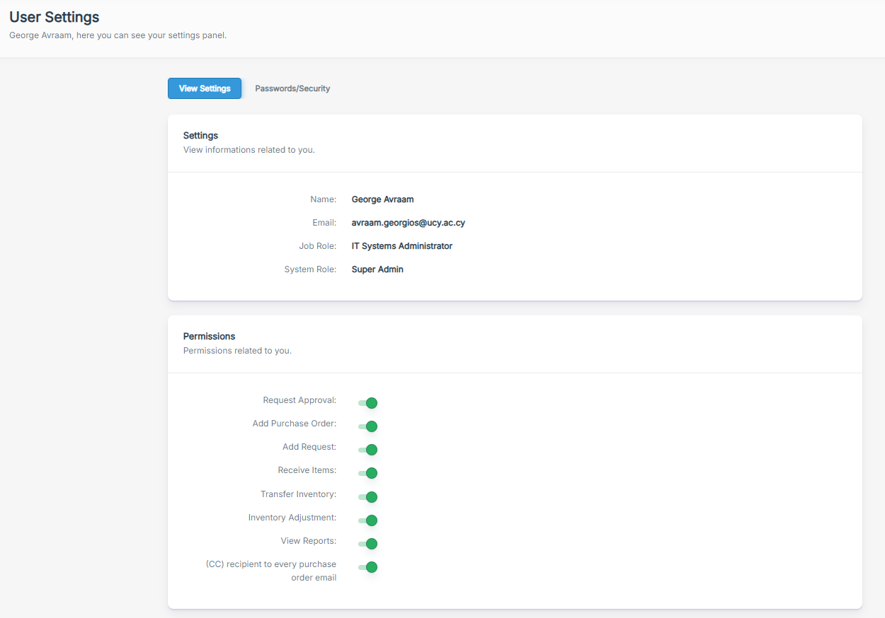  
*Personal settings panel showing your system role, job role, and feature-level toggles.*

---

### Reporting

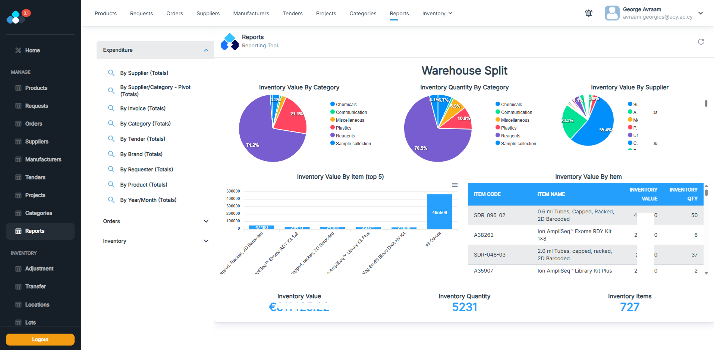  
*Reporting tool with pie charts, bar graphs, and export options*

## Docker
The project includes Docker support to simplify the setup for both the API and frontend.

To Be Implemented (TBI)
Detailed Docker setup instructions coming soon.

## Contributing
Contributing
Feel free to submit issues or pull requests to contribute to the project. Ensure that any major changes are discussed via an issue first to avoid conflicts.
